<p align="center">
  
</p>

<p align="center">
  
  <a href="https://www.python.org/downloads/"></a>
  <a href="https://modelcontextprotocol.io/"></a>
  
  <a href="LICENSE"></a>
</p>

<p align="center"><b>Your whole Starlink terminal fleet, one conversation away.</b> An MCP server for the Starlink Enterprise API: ask Claude about terminals, signal and obstructions, service lines and data usage, addresses and coverage, in plain English.</p>

---

## ✨ Ask things like

> *"Give me this morning's fleet status."*
> *"Which terminals had obstructions today?"*
> *"Show Rig-04's telemetry for the last 7 days."*
> *"How much data did the North Sea vessel use in September?"*
> *"Is Starlink available at this address before we ship a kit there?"*
> *"Which subscription plans can we choose from?"*

It's built for teams running **many terminals**: fleet operators, IT teams watching uptime, and operations managers tracking usage.

## ⚙️ How it works

<p align="center">
  
</p>

- **One file, two dependencies.** `starlink-mcp-server.py` runs over stdio with `mcp` and `httpx`.
- **Service-account auth.** It exchanges your **client ID and secret** for an access token, caches the token, and refreshes it shortly before it expires.
- **Read-only by design.** All 12 tools read; nothing changes your account or terminals.

| Group | Tools |
|---|---|
| **Terminals** (4) | `list_user_terminals`, `get_terminal_details`, `get_terminal_telemetry` (uptime, signal quality, obstructions, throughput), `get_terminal_history` |
| **Service lines** (3) | `list_service_lines`, `get_service_line_details`, `get_data_usage` (for a date range) |
| **Addresses** (3) | `list_addresses`, `get_address_details`, `check_service_availability` |
| **Account** (2) | `get_account_overview` (the whole fleet at a glance), `list_subscription_products` |

## 🚀 Setup

**1. Get API access.** The Enterprise API is available on request to Starlink Business and Enterprise customers. Ask your account manager, or email `business-support@starlink.com`. Then create a service account:
1. Sign in at [starlink.com/account](https://www.starlink.com/account) and open **Settings**.
2. Under **Service Accounts**, click **+ Add Service Account**.
3. Copy the **Client ID** and **Client Secret**.

**2. Get the code.** You need **Python 3.10+** and [`uv`](https://github.com/astral-sh/uv).

```bash
git clone https://github.com/ry-ops/starlink-enterprise-mcp-server
cd starlink-enterprise-mcp-server
uv sync          # installs mcp and httpx
```

**3. Connect Claude Desktop.** Add this to `claude_desktop_config.json`. On macOS it's in `~/Library/Application Support/Claude/`; on Windows, `%APPDATA%\Claude\`; on Linux, `~/.config/Claude/`.

```json
{
  "mcpServers": {
    "starlink": {
      "command": "uv",
      "args": ["--directory", "/absolute/path/to/starlink-enterprise-mcp-server", "run", "python", "starlink-mcp-server.py"],
      "env": {
        "STARLINK_CLIENT_ID": "your_client_id",
        "STARLINK_CLIENT_SECRET": "your_client_secret"
      }
    }
  }
}
```

Credentials come **only from environment variables**: `STARLINK_CLIENT_ID` and `STARLINK_CLIENT_SECRET`. `secrets.env` is a template listing them; the server doesn't read it. Quit and reopen Claude Desktop, and "starlink" appears in its tools.

## 🔒 Security

- **Keep the client secret out of git.** Put it in your MCP client's `env`, or in a secrets manager.
- **Use a dedicated service account** for this server, so you can rotate or revoke it without touching anything else.
- **The tools only read,** but they can see your whole fleet: terminal locations, usage and plans. Treat the credentials accordingly.

## 🤝 Agent-to-agent (A2A)

[`agent-card.json`](agent-card.json) lists the server's 12 skills, one per tool, with their inputs and auth requirements, so other agents can discover and call them.

## 🩺 Troubleshooting

<details>
<summary><b>"credentials not configured"</b></summary>

`STARLINK_CLIENT_ID` and `STARLINK_CLIENT_SECRET` aren't set in the server's environment. Add them to the `env` block of your MCP config.
</details>

<details>
<summary><b>"Authentication failed"</b></summary>

Check the client ID and secret, and that the service account hasn't been deleted. API access has to be enabled on your account first.
</details>

<details>
<summary><b>Rate-limit errors (429)</b></summary>

The server doesn't retry on its own. Ask for less at once, for example one terminal's history rather than all of them, and try again shortly.
</details>

<details>
<summary><b>"starlink" doesn't show up in Claude</b></summary>

Use an absolute path in `--directory`, check the JSON is valid, and quit Claude Desktop completely before reopening it.
</details>

There's a one-page cheat sheet in [quick-reference.md](quick-reference.md).

## License

MIT. See [LICENSE](LICENSE).

<!-- org-footer -->
---

<p align="center"><sub>Part of <a href="https://github.com/ry-ops">ry-ops</a> · building the pipes between infrastructure, automation, and observability · built by <a href="https://github.com/ry-ops">ry-ops</a></sub></p>
